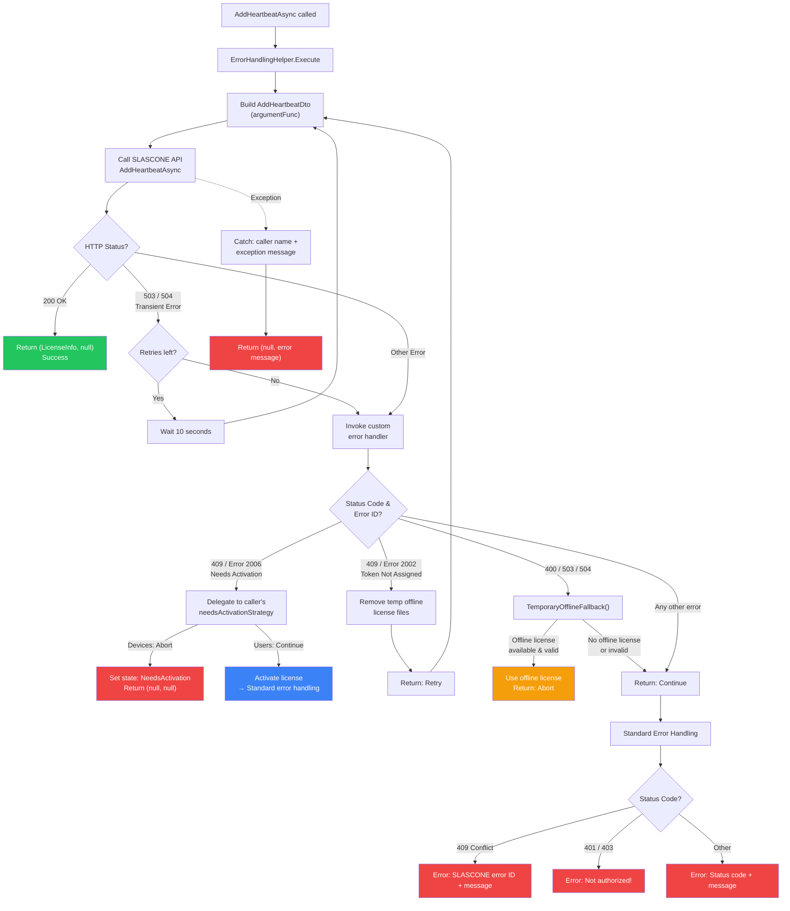

# LICENSING & ANALYTICS FOR SOFTWARE AND IoT VENDORS
A demo client application (WPF) for SLASCONE software licensing, which uses the official NuGet package. Its main purpose is to demonstrate how you can enable online and/or offline device licensing (at the same time), while providing a rudimentary/explanatory UI. Although this is a desktop application, the same principles apply for other application types as well. Both named and floating licenses can be used.

Depending on your application you might need:

- both online and offline mode (most desktop applications)
- online mode only (application servers/backends)
- offline mode only (any application type with no connectivity)

This demo also implements a named user licensing scenario. While it uses Azure AD B2C for authentication, the same principles apply for any identity provider.

## CONNECTING TO YOUR SLASCONE ENVIRONMENT

The application connects to the SLASCONE official demo environment. In order to connect to your SLASCONE environment, adjust the values of the file `LicensingService.cs`.

## ONLINE

Online is the recommended licensing mode, since it unleashes the full functionality of SLASCONE.

### ACTIVATION (key based)
The online activation is a very straightforward process, requiring a license key.

### REFRESH/HEARTBEATS
After a successful activation, the application sends a periodic heartbeat (license check) to ensure that the license parameters are up to date.

A heartbeat might fail due to primarily two reasons:
- No connectivity
- The license is not valid anymore (e.g., deactivated, expired).

#### TEMPORARILY OFFLINE - FREERIDE
If a heartbeat fails, you normally do not want to restrict software access immediately. Instead, you typically want to notify the user and ensure that the problem can be remedied (e.g., by going online), within a reasonable amount of time.

[Freeride](https://support.slascone.com/hc/en-us/articles/7702036319261#freeride) comes into play for such scenarios. In this example freeride is set to 7 days, but the value can be changed in the SLASCONE web portal.

### UNASSIGN
The licensing lifecycle for a device ends with its unassigning/deactivation. It is recommended to provide an area in your software, in which the end user can unassign the used license code, so that this can be used on another device (typical hardware migration scenario).

## OFFLINE
Please refer to this [article](https://support.slascone.com/hc/en-us/articles/4412248454161), in order to find more information about permanently offline scenarios.

### ACTIVATION (file based)

Activation in offline scenarios is a 2-step process requiring two license (xml) files:

- the license file
- the activation file

After uploading the license file, an activation file has to be generated and uploaded too. Since the client is offline this generation has to be done on a proxy device using:
- the generated link
- or the QR code

By uploading the activation file, the activation is complete.

## NAMED vs FLOATING

This application automatically recognizes the provisioning mode of the inserted license (named or floating). In case of a floating license, the application opens a session as described [here](https://support.slascone.com/hc/en-us/articles/360016001677-NAMED-DEVICE-LICENSES).

## NAMED USER LICENSING
This application also depicts named user licensing. 
Please refer to this [article](https://support.slascone.com/hc/en-us/articles/360017647817-NAMED-USER-LICENSES) to find more information about named user licenses.

### AZURE AD B2C
This application uses Azure AD B2C for user authentication. In order to use Azure AD B2C (private SLASCONE deployments only), you need to register an application in your Azure AD B2C tenant and configure the application to use Azure AD B2C for authentication. The application uses the MSAL.NET library to authenticate users with Azure AD B2C and obtain access tokens to access APIs.

## Analytics

The application sends analytics data to SLASCONE. 
The data is used to provide insights into the usage of the application. 
The data is sent in the background and does not affect the user experience. 
The data is sent in a secure way and is only used for analytics purposes.

### License feature visualization

If a valid license is present, the application shows licensed features as menu items in the features menu.

On a click on a licensed feature, the application sends an usage heartbeat to SLASCONE. 

## SOFTWARE UPDATES/SHIPMENT

In the SLASCONE portal, you can manage software releases for your products. You can store software shipments for these releases. 
When a license heartbeat is generated or a license is activated, your application can transmit the current version number. 
The returned license information will then indicate whether there is a current software version matching the license. 
Learn more about managing software releases in the SLASCONE portal in this [article](https://support.slascone.com/hc/en-us/articles/360016055257-CREATING-A-PRODUCT).

In the demo client, both the current version and information about any potentially available newer version are displayed in the About Box:

## Error handling and retry logic

The following section describes the error handling and retry logic for the online licensing mode when adding a license heartbeat (`AddHeartbeatAsync` in `LicensingService.cs` and `ErrorHandlingHelper.Execute`).

### Description

When the application refreshes license information, it calls `AddHeartbeatAsync`, which delegates to `ErrorHandlingHelper.Execute` — a generic wrapper that provides retry logic and structured error handling for all SLASCONE API calls.

**Retry loop (ErrorHandlingHelper.Execute):**
The helper invokes the SLASCONE API and inspects the HTTP status code of the response:
- **200 OK** — The heartbeat succeeded. The license information is returned immediately.
- **503 Service Unavailable / 504 Gateway Timeout** — A transient server error. The helper waits 10 seconds and retries the call (max 1 retry). If all retries are exhausted, the custom error handler is invoked.
- **Any other error** — The custom error handler is invoked immediately (no automatic retry).

**Custom error handler (AddHeartbeatAsync):**
The custom handler in `AddHeartbeatAsync` evaluates the error response:
- **409 Conflict, Error 2006** (license needs activation) — Delegates to the caller's `needsActivationStrategy`. For device-based licensing this aborts processing; for user-based licensing this triggers an activation attempt.
- **409 Conflict, Error 2002** (token not assigned) — Removes temporary offline license files and signals a retry so that the next attempt uses a fresh token.
- **400 Bad Request / 503 / 504** — Attempts a temporary offline fallback. If a valid offline license is available within the freeride period, the offline license is used and processing is aborted. Otherwise, standard error handling continues.
- **Any other error** — Falls through to standard error handling (Continue).

**ErrorHandlingControl return values:**
The custom handler returns one of three values that control the retry loop:
- `Continue` — Exit the loop and proceed with standard error handling (returns an error message).
- `Retry` — Re-enter the loop with a fresh input argument (e.g., after removing stale token data).
- `Abort` — Stop immediately and return `(null, null)` — the caller is expected to have already set the licensing state.

**Standard error handling:**
If the loop exits via `Continue`, a human-readable error message is generated based on the status code:
- 409 Conflict → SLASCONE error ID and message
- 401 / 403 → "Not authorized!"
- Other → Generic status code and message

**Exception handling:**
If an unhandled exception occurs at any point, it is caught and returned as an error message containing the caller method name and exception details.

### Diagram

